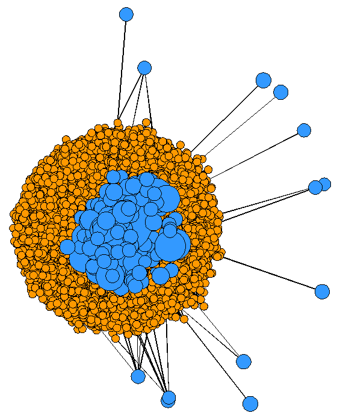
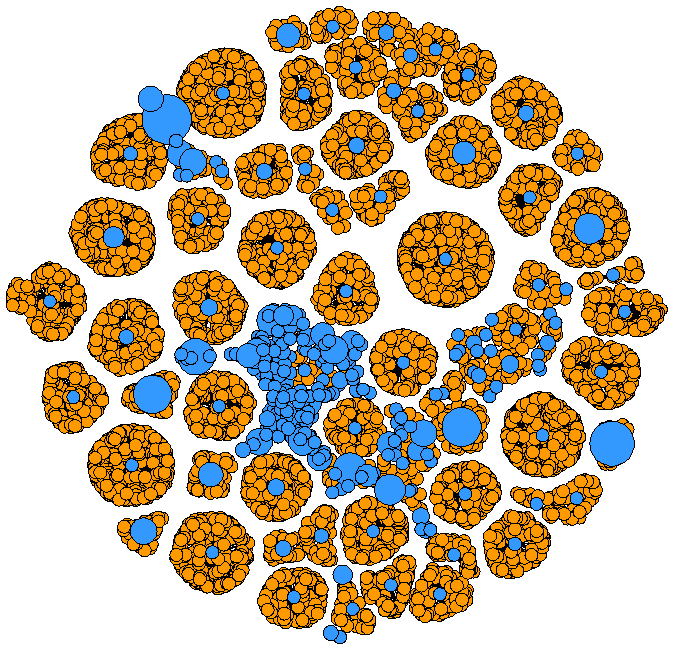
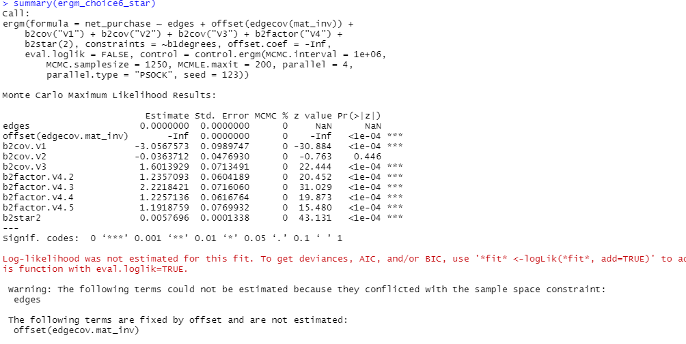

# Network Based Discrete Choice Model
Tutorial of network-based discrete choice modeling based on bipartite Exponential Random Graph Model (ERGM) approach. This demonstration contains code and data associated with the test case 1 (ChoiceSet6) in paper "A network-based discrete choice model for decision-based design."

## License
Feel free to use all or portions for your research or related projects so long as you provide the following citation information:

Sha, Z., Cui, Y., Xiao, Y., Stathopoulos, A., Contractor, N., Fu, Y. and Chen, W., 2023. A network-based discrete choice model for decision-based design. Design Science, 9, p.e7.

```
@article{sha2023network,
  title={A network-based discrete choice model for decision-based design},
  author={Sha, Zhenghui and Cui, Yaxin and Xiao, Yinshuang and Stathopoulos, Amanda and Contractor, Noshir and Fu, Yan and Chen, Wei},
  journal={Design Science},
  volume={9},
  pages={e7},
  year={2023},
  publisher={Cambridge University Press}
}
```

## Notes

1. The data are anonymized, with each feature denoted by V1, V2, V3, and V4. The first three features (V1, V2, and V3) are continuous variables after scaling, while V4 is a categorical variable.
2. The data provided is intended solely for tutorial purposes and should not be used to reproduce the results presented in the paper.
3. The code is divided into four parts:
   - Part 1: Load data and network construction
   - Part 2: Network visualization
   - Part 3: ERGM estimation
   - Part 4: ERGM prediction
4. The required package is the `statnet` package. You can install it by running the following command in R:
```R
install.packages("statnet")
```

## Data

The data files should be placed in the same directory as the code file or in a specified path. The data files are:

- `Sampled_data_to_share.csv`
- `test_data_to_share.csv`

## Codes

The codes file can also be found in Code_choice_set_6.R

### Part 1: Load Data and Network Construction

```R
# data1-5000 customer, each has 6 products in choice set and 1 product finally buy
data_train <- read.csv("Sampled_data_to_share.csv", header = TRUE) 
data_train$V4 <- as.factor(data_train$V4)
data_train$V4 <- relevel(data_train$V4, "A")

# function to set attributes
set_attr <- function(df, net, attr_product){
  df$src <- df$rspd_id
  df$dest <- df$model_id
  unique_rspd <- unique(df$rspd_id)
  unique_model <- unique(df$model_id)
  
  set.vertex.attribute(net, attrname = names(attr_product)[1:(ncol(attr_product)-1)], value = attr_product[1:(ncol(attr_product)-1)], v = attr_product$dest)
  return(net)
}

# function to create networks based on the data frame
# function to create networks based on the data frame
make_network <- function(df){
  # add src and dest id to dataframe
  df$src <- df$rspd_id
  df$dest <- df$model_id
  unique_rspd <- unique(df$rspd_id)
  unique_model <- unique(df$model_id)
  num_rspd <- length(unique_rspd)
  num_model <- length(unique_model)
  for(i in 1:nrow(df)){
    df$src[i] <- which(unique_rspd == df$src[i])
    df$dest[i] <- which(unique_model == df$dest[i]) + num_rspd
  }
  
  # add product attributes here
  attr_product <- unique(df[,c("V1", "V2", "V3", "V4", "dest")])
  
  ## inverse consideration network
  el = as.matrix(df[c('src','dest')])
  net_consideration <- network(x = el, matrix.type = "edgelist", directed = F, 
                               bipartite = num_rspd)
  mat_inv <- 1- as.matrix.network(net_consideration)
  
  
  ## purchase network
  el_purchase = as.matrix(df[df$purchase == 1, c('src','dest')])
  attr(el_purchase,'n') = length(unique_model)+length(unique_rspd)
  net_purchase <- network(x = el_purchase, matrix.type = "edgelist", directed = F,
                          bipartite = num_rspd)
  
  net_purchase <- set_attr(df, net_purchase, attr_product)
  net_consideration <- set_attr(df, net_consideration, attr_product)
  
  return(list("net_purchase" = net_purchase, "net_consideration" = net_consideration, "mat_inv" = mat_inv))
}

# make network lists: inclued net_purchase, net_consideration and mat_inv
newList <- make_network(data_train)

net_purchase <- newList$net_purchase
net_consideration <- newList$net_consideration
mat_inv <- newList$mat_inv

# check the summary statistics of net_purchase and net_consideration
summary(net_purchase)
summary(net_consideration)
```
A brief glance at the output
| Network attributes | net_purchase | net_consideration |
|--------------------|--------------|-------------------|
| Vertices | 5281 | 5281 |
| Directed | FALSE | FALSE |
| Hyper | FALSE | FALSE |
| Loops | FALSE | FALSE |
| Multiple | FALSE | FALSE |
| Bipartite | 5000 | 5000 |
| Total edges | 5000 | 30000 |
| Missing edges | 0 | 0 |
| Density | 0.0003586327 | 0.002151796 |
| Vertex attributes | V1, V2, V3, V4 | V1, V2, V3, V4 |
| Edge attributes | FALSE | FALSE |


### Part 2: Network Visualization

```R
mat_purchase <- as.matrix(net_purchase)
plot(net_purchase,
     vertex.cex=ifelse(network.vertex.names(net_purchase)>5000,
                       apply(mat_purchase,2,sum)/100+1, 1),
     usearrows = FALSE,
     vertex.col = ifelse(network.vertex.names(net_purchase)>5000,
                         "#3399FF","#FF9900"))

mat_consider <- as.matrix(net_consideration)
plot(net_consideration,
     vertex.cex=ifelse(network.vertex.names(net_consideration)>5000,
                       apply(mat_consider,2,sum)/100+1, 1),
     usearrows = FALSE,
     vertex.col = ifelse(network.vertex.names(net_consideration)>5000,
                         "#3399FF","#FF9900"))
```
Below are the output visualizations, where blue nodes depict products and orange nodes represent customers. The edges connecting customers and products indicate that the customers consider or purchase the product. The popularity of products among customers is reflected by the size of the product nodes, with larger nodes indicating higher popularity.

<table>
  <tr>
    <td>
    <td>
  </tr>
 </table>


### Part 3: ERGM estimation

```R
## Choice set 6: multinomial choice + varing choice set: offset and constraints
# the model by adding constraint to control to make sure one customer only make one choice among the consideration set (i.e., the choice set)

# ERGM_null
date()
ergm_choice6_null <- ergm(net_purchase ~ edges + offset(edgecov(mat_inv)) +
                            b2cov("V1") + b2cov("V2") + b2cov("V3")  + b2factor("V4"), offset.coef = -Inf, constraints=~b1degrees,
                          control = control.ergm(MCMC.samplesize = 1250, MCMC.interval = 1000000, 
                                                 MCMLE.maxit = 100, parallel=4, parallel.type="PSOCK",seed = 123),
                          eval.loglik = FALSE)

date()
summary(ergm_choice6_null)


# ERGM_degree
date()
ergm_choice6_degree <- ergm(net_purchase ~ edges + offset(edgecov(mat_inv)) +
                              b2cov("V1") + b2cov("V2") +
                              b2cov("V3")  + b2factor("V4") + b2degrange(25),
                            offset.coef = -Inf, constraints=~b1degrees,
                            control = control.ergm(MCMC.interval= 1000000, MCMC.samplesize=1250,
                                                   MCMLE.maxit = 30, parallel=4, parallel.type="PSOCK", seed = 123),
                            eval.loglik = FALSE)
date()
summary(ergm_choice6_degree)


# ERGM_star
date()
ergm_choice6_star <- ergm(net_purchase ~ edges + offset(edgecov(mat_inv)) +
                            b2cov("V1") + b2cov("V2") +
                            b2cov("V3")  + b2factor("V4") + b2star(2),
                          offset.coef = -Inf, constraints=~b1degrees,
                          control = control.ergm(MCMC.interval= 1000000, MCMC.samplesize=1250,
                                                 MCMLE.maxit = 30, parallel=4, parallel.type="PSOCK", seed = 123),
                          eval.loglik = FALSE)
date()

summary(ergm_choice6_star)

# ERGM_both
date()
ergm_choice6_both <- ergm(net_purchase ~ edges + offset(edgecov(mat_inv)) +
                            b2cov("V1") + b2cov("V2") +
                            b2cov("V3")  + b2factor("V4") + b2star(2) + b2degrange(25),
                          offset.coef = -Inf, constraints=~b1degrees,
                          control = control.ergm(MCMC.interval= 1000000, MCMC.samplesize=1250,
                                                 MCMLE.maxit = 50, parallel=4, parallel.type="PSOCK", seed = 123),
                          eval.loglik = FALSE)
date()

summary(ergm_choice6_both)
```
Below shows an example of the estimation result.




### Part 4: ERGM Prediction

```R
############# Prepare the testing network
data_test <- read.csv("test_data_to_share.csv", header = TRUE)
data_test$V4 <- as.factor(data_test$V4)
data_test$V4 <- relevel(data_test$V4, "A")

# make network lists
newList_test <- make_network(data_test)

net_purchase_test <- newList_test$net_purchase
net_consideration_test <- newList_test$net_consideration
mat_inv_test <- newList_test$mat_inv

## Choice set 6: multinomial choice + varing choice set: offset and constraints

############# Manually calculate the probability
considernet_train <- as.matrix.network(net_consideration)
purchasenet_train <- as.matrix.network(net_purchase)
considernet_test <- as.matrix.network(net_consideration_test)
purchasenet_test <- as.matrix.network(net_purchase_test)

n1 <- nrow(purchasenet_test) # the number of nodes in first layer
n2 <- ncol(purchasenet_test) # end nodes in second layer

## example for prediction on ERGM_star, with choice set 6:

prob_y_star <- matrix(0.0, n1, n2)

# the trained model
model_train_star <- ergm_choice6_star #it should be a bipartite model

# just run for a single iteratation to get ERGM structure for the test network
ergm_choice6_star_test <- ergm(net_purchase_test ~ edges + offset(edgecov(mat_inv)) +
                                 b2cov("V1") + b2cov("V2") +
                                 b2cov("V3")  + b2factor("V4") + b2star(2),
                               offset.coef = -Inf, constraints=~b1degrees,
                               control = control.ergm(MCMC.interval= 1000000, MCMC.samplesize=1250,
                                                      MCMLE.maxit = 1, parallel=4, parallel.type="PSOCK", seed = 123),
                               eval.loglik = FALSE)
# the test model
model_test_star <- ergm_choice6_star_test

# get the original g(y) - network statistics in ERGM formula
xAlt <- model_test_star
xAlt$formula <- nonsimp_update.formula(xAlt$formula, xAlt$network ~ .) # this allows the update of g(y) when network changes
z <- summary(xAlt$formula)


### calculate and update the probability matrix for each pair of node
sample_size <- 5000

date()

for (i in 1:sample_size){
  zAlt <- list() # create a list to store g1 - g6
  n = 1 # denote the order of cars in customer i's consideration list
  k <- which(purchasenet_test[i,]==1) + 5000 # k is i's choice
  for(j in (which(considernet_test[i,]==1) + 5000)){
    if(k == j){
      zAlt[[n]] <- z   #if j is customer's choice, xAlt should be the original one
      # get the value of gn
    }else {
      xAlt$network[i,j] <- 1  # add a link between i and j
      xAlt$network[i,k] <- 0  # remove the link between i and k
      zAlt[[n]] <- summary(xAlt$formula)  #get the value of gn
      xAlt$network[i,j] <- 0
      xAlt$network[i,k] <- 1  # return to the original network
    }
    n <- n + 1
  }
  # got a list of g1 - g6, which is stored at zAlt
  
  # calculate p1 - p6 specifically
  n <- 1
  for(j in (which(considernet_test[i,]==1) + 5000)){
    expsum <- 0
    for(num in 1:6){
      temp <- zAlt[[num]] - zAlt[[n]]
      expsum <- exp(sum(model_train_star$coef[-2]*temp[-2])) + expsum
    }
    p <- 1.0/expsum
    prob_y_star[i,j-n1] <- p
    n <- n + 1
  }
}

date()

### evaluation: Top N methods
right_wrong_ratio <- array(data = 0, dim = sample_size)

for(i in 1:sample_size){
  temp_set <- prob_y_star[i,which(considernet_test[i,]==1)]
  temp_set <- sort(temp_set, decreasing  = TRUE)
  for(k in which(considernet_test[i,]==1)){
    for (m in 1:3){ # this is for top 3
      # change the range to calculate the results for top N
      if (prob_y_star[i,k] == temp_set[m]
          && purchasenet_test[i,k] == 1){
        right_wrong_ratio[i] = 1
      }
    }
  }
}

right_ratio = sum(right_wrong_ratio)/length(right_wrong_ratio)
print(right_ratio)
```

